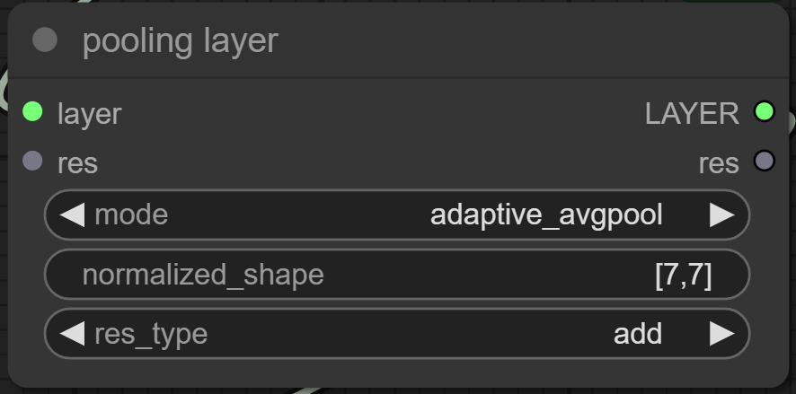
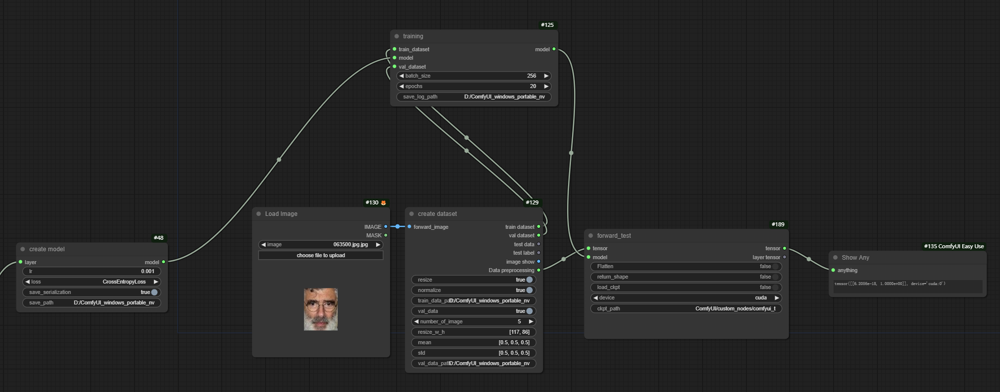

# ComfyUI Build and Train Your Network

This is an extension project aimed at customizing neural network layers (such as linear layers, convolutional layers,
etc.) in ComfyUI and providing simplified task training functionality. With this project, you can easily build custom
neural network layers in a graphical manner in ComfyUI and complete training, thereby extending its functionality.

## Table of Contents

- [Features](#features)
- [Installation](#installation)
- [Description](#Description)

## Features

- ✨ **Custom Neural Network Layers**: Users can add and configure custom neural network layers, such as linear layers
  and convolutional layers, within ComfyUI.
- 🚀 **Simplified Task Training Functionality**: It offers a streamlined training process.

## Installation

### Steps

1. **Clone the repository**
    ```bash
    git clone https://github.com/linhusyung/comfyui-Build-and-train-your-network.git
    ```

2. **Navigate to the project directory**
    ```bash
    cd comfyui-Build-and-train-your-network
    ```

3. **Modify ComfyUI for gradient calculation**

   In ComfyUI, tensor calculations do not produce gradients. To resolve this issue, you need to modify the
   `ComfyUI/execution.py` file by commenting out `with torch.inference_mode():` and moving all the code within this
   context manager one level forward. If you prefer not to do this manually, you can copy the `replace/execution.py` from the project to
   `ComfyUI/execution.py`, like this:

    ```bash
    copy .\replace\execution.py ..\..\execution.py
    ```

   **Note:** Modifying `ComfyUI/execution.py` might cause issues with image generation. If this happens, don't worry;
   you can restore the original state by running the following command:

    ```bash
    copy .\replace\execution1.py ..\..\execution.py
    ```


## Description

### Conv Layer

<div style="text-align:center;">
    
</div>

**Description:**
pass

### Activation Function

<div style="text-align:center;">
    
</div>

**Description:**
pass

### Normalization

<div style="text-align:center;">
    
</div>

**Description:**
pass

### Pooling Layer

<div style="text-align:center;">
    
</div>

**Description:**
pass

### View

<div style="text-align:center;">
    
</div>

**Description:**
pass

### Fully Connected Layer

<div style="text-align:center;">
    
</div>

**Description:**
pass

### Create model

<div style="text-align:center;">
    
</div>

**Description:**
pass

### create dataset

<div style="text-align:center;">
    
</div>

**Description:**
pass

### train

<div style="text-align:center;">
    
</div>

**Description:**
pass

### pre train model

<div style="text-align:center;">
    
</div>

**Description:**
pass

### Example of Residual Module

<div style="text-align:center;">
    
</div>

**Description:**
pass

### test your train model

<div style="text-align:center;">
    
</div>

**Description:**
pass
