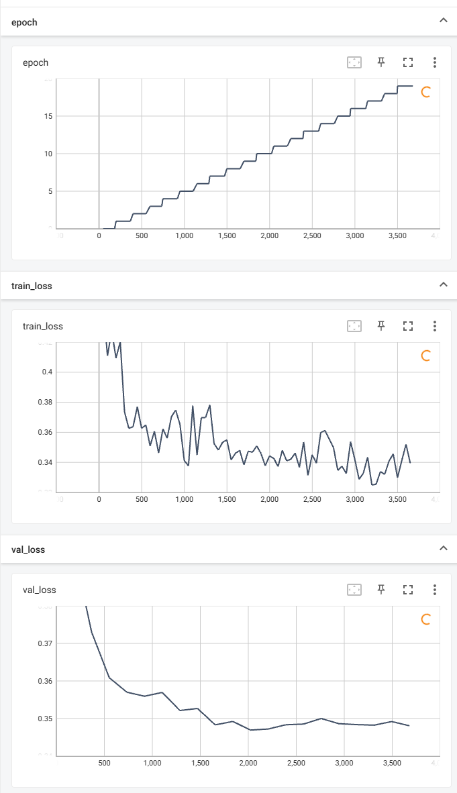

# ComfyUI Build and Train Your Network

Stable Diffusion is an image generation technique based on diffusion models. Its core idea involves simulating diffusion
processes by iteratively adding noise and using neural networks to predict and remove the noise, thereby generating
high-quality images. This approach is not limited to image generation; with appropriate network architecture and
training data, it can be adapted for various other tasks. The application of neural networks extends beyond image
generation. By adjusting network structures and loss functions, neural networks can also perform tasks such as
classification and regression. This flexibility makes neural networks a powerful tool for handling a wide range of
machine learning tasks.

This project aims to expand custom neural network layers (such as linear layers, convolutional layers, etc.) within
ComfyUI and provide simplified task training functionalities. Through this project, users can easily construct custom
neural network layers and perform training in ComfyUI using a graphical interface.

## Table of Contents

- [Features](#features)
- [Installation](#installation)
- [Description](#Description)

## Features

- ✨ **Custom Neural Network Layers**: Users can add and configure custom neural network layers, such as linear layers
  and convolutional layers, within ComfyUI.
- 🚀 **Simplified Task Training Functionality**: It offers a streamlined training process.

## Installation

### Steps

0. **Install Comfyui**

   If you haven't installed ComfyUI [before](https://github.com/comfyanonymous/ComfyUI.git) you can go here to install
   it and follow the steps, or download [my version
   of ComfyUI](https://github.com/comfyanonymous/ComfyUI.git).
1. **Clone the repository**
    ```bash
    git clone https://github.com/linhusyung/comfyui-Build-and-train-your-network.git
    ```

2. **Navigate to the project directory**
    ```bash
    cd comfyui-Build-and-train-your-network
    ```

3. **Modify ComfyUI for gradient calculation**

   In ComfyUI, tensor calculations do not produce gradients. To resolve this issue, you need to modify the
   `ComfyUI/execution.py` file by commenting out `with torch.inference_mode():` and moving all the code within this
   context manager one level forward. If you prefer not to do this manually, you can copy the `replace/execution.py`
   from the project to
   `ComfyUI/execution.py`, like this:

    ```bash
    copy .\replace\execution.py ..\..\execution.py
    ```

   **Note:** Modifying `ComfyUI/execution.py` might cause issues with image generation. If this happens, don't worry;
   you can restore the original state by running the following command:

    ```bash
    copy .\replace\execution1.py ..\..\execution.py
    ```

## Description

### Conv Layer

<div style="text-align:center;">
    
</div>

**Description:**
The operation of a convolutional layer involves sliding convolution kernels over the input feature map, performing
element-wise multiplication with the local region at each step, and then summing all the multiplication results to form
a single element in the output feature map. The movement of the kernels and the size of the output feature map are
controlled by setting the stride and padding. If the input feature map has multiple channels (e.g., three channels for
an RGB image), each channel of the input is multiplied element-wise with the corresponding channel of the kernel, and
the results across all channels are summed to produce the output. When the number of output channels is 8, the system
employs 8 convolution kernels for convolutional operations and concatenates them along the channel dimension to form the
output feature map.

### Activation Function

<div style="text-align:center;">
    
</div>

**Description:**
The activation function plays a crucial role in neural networks by introducing non-linearity, allowing the network to
learn complex patterns and representations. The activation function operates on the output of each neuron, transforming
the linear combination of inputs into a non-linear output. Common activation functions include:

#### ReLU (Rectified Linear Unit)

ReLU transforms negative input values to zero and keeps positive values unchanged, defined as:
$f(x) = \max(0, x)$
ReLU is computationally simple and widely used in many deep learning models.

#### Sigmoid

The Sigmoid function compresses input values to a range between 0 and 1, defined as:
$f(x) = \frac{1}{1 + e^{-x}}$
It is often used in the output layer to represent probabilities.

#### Tanh (Hyperbolic Tangent)

Tanh compresses input values to a range between -1 and 1, defined as:
$f(x) = \tanh(x)$
Compared to Sigmoid, Tanh's output mean is zero, which can be beneficial for certain networks.

#### Leaky ReLU

Leaky ReLU is a variant of ReLU that allows small negative values to pass through, defined as:
$f(x) = x \text{ if } x > 0, \text{ otherwise } f(x) = \alpha x$
(usually $\alpha = 0.01$).

#### Softmax

The Softmax function converts a vector of values into a probability distribution, where the probability of each value is
proportional to the exponent of the value, defined as:
$f(x_i) = \frac{e^{x_i}}{\sum_{j} e^{x_j}}$
Softmax is often used in the output layer of a classification network to represent the probabilities of each class.

By applying an activation function after each layer, neural networks can capture more complex and diverse features,
thereby enhancing the model's expressive power and performance.

### Normalization

<div style="text-align:center;">
    
</div>

**Description:**
Normalization techniques play a crucial role in improving the training and performance of neural networks by stabilizing
and accelerating convergence. Here are different types of normalization methods commonly used in deep learning:

#### Batch Normalization (BatchNorm1d, BatchNorm2d)

Batch Normalization normalizes the activations of each layer across the batch dimension. For 1-dimensional and
2-dimensional inputs:

- **BatchNorm1d**: Normalizes along the feature dimension (typically used in fully connected layers).
- **BatchNorm2d**: Normalizes along the channel dimension (typically used in convolutional layers).

For both BatchNorm1d and BatchNorm2d, the normalization process is defined as:
$f(x) = \frac{x - \mu}{\sqrt{\sigma^2 + \epsilon}} \cdot \gamma + \beta$
where $\( \mu \) and \( \sigma^2 \)$ are the mean and variance of the batch, $\( \epsilon \)$ is a small constant to
prevent
division by zero, $\( \gamma \) and \( \beta \)$ are learnable parameters (scale and shift).

#### Layer Normalization (LayerNorm)

Layer Normalization normalizes the activations across the feature dimension independently for each example in the batch.
It is defined as:
$f(x) = \frac{x - \mu}{\sqrt{\sigma^2 + \epsilon}} \cdot \gamma + \beta $
where $\( \mu \) and \( \sigma^2 \)$ are the mean and variance computed along the feature dimension.

By incorporating normalization techniques like BatchNorm1d, BatchNorm2d, or LayerNorm into neural networks, training can
be more stable and converge faster, leading to improved overall performance and generalization.

### Pooling Layer

<div style="text-align:center;">
    
</div>

**Description:**
Pooling layers are used in convolutional neural networks (CNNs) to progressively reduce the spatial size of the
representation to reduce the amount of parameters and computation in the network, and to control overfitting. Here are
different types of pooling layers commonly used:

#### Adaptive Average Pooling (AdaptiveAvgPool2d)

Adaptive Average Pooling allows the output size to be specified instead of the kernel size. It adaptively performs
average pooling to the desired output size. For 2-dimensional inputs:

- **AdaptiveAvgPool2d**: Outputs a 2D tensor with a specified output size.

#### Max Pooling (MaxPool2d)

Max Pooling extracts the maximum value from each patch of the feature map. For 2-dimensional inputs:

- **MaxPool2d**: Computes the maximum value over a spatial window.

#### Average Pooling (AvgPool2d)

Average Pooling computes the average value of each patch of the feature map. For 2-dimensional inputs:

- **AvgPool2d**: Computes the average value over a spatial window.

Pooling layers help in reducing the spatial dimensions of the input while retaining important features, making the
network more robust and efficient in processing spatial hierarchies.

### View

<div style="text-align:center;">
    
</div>

**Description:**
The View layer flattens a tensor along a specified dimension, maintaining its data integrity.

### Fully Connected Layer

<div style="text-align:center;">
    
</div>

**Description:**
In neural networks, the Fully Connected layer, also known as a Dense layer, connects every neuron in one layer to every
neuron in the next layer. This type of layer performs a linear transformation on its input, followed by an optional bias
addition, similar to how normalization layers adjust and scale input data for optimal training and performance.

The Fully Connected layer linearly transforms the input tensor by multiplying it with learned weights and adding a bias
term, akin to how normalization layers adjust and scale input data for optimal training and performance.

### Create model

<div style="text-align:center;">
    
</div>

**Description:**
Integrating previously constructed layers into the neural network architecture, defining how the network computes the
difference between its output and the true labels (loss), and setting the learning rate.The entire network architecture
can be saved for Python to call upon.Example
Code: [use_python_Instantiate_network_example/a.py](use_python_Instantiate_network_example/a.py)

### create dataset

<div style="text-align:center;">
    
</div>

**Description:**
This node converts data into an iterator-like form and performs preprocessing tasks such as resizing all
images to a uniform size and applying z-score normalization. Typically, mean and standard deviation values for
normalization are based on statistics from large datasets like ImageNet or can be calculated from your own dataset. When
a single image is input into this node, it outputs a preprocessed tensor suitable for training or testing your neural
network.But now, it only supports image classification tasks, and the dataset should be structured as follows.

- train_data/
    - male/
        - image1.jpg
        - image2.jpg
        - ...
    - female/
        - image101.jpg
        - image102.jpg
        - ...
- val_data/
    - male/
        - image1.jpg
        - image2.jpg
        - ...
    - female/
        - image101.jpg
        - image102.jpg
        - ...

### train

<div style="text-align:center;">
    
</div>

**Description:**
This node involves updating neural network parameters through gradient descent using pre-defined models and
datasets (`train_dataset` and optionally `val_dataset`). It allows customization of where training data is saved during
the process.

### Example of Residual Module

<div style="text-align:center;">
    
</div>

**Description:**
In previous research, it has been observed that directly outputting results from neural networks may not always yield
optimal performance. Therefore, the concept of using residual connections has been proposed to enhance network
performance. In this project, every layer node supports residual connections as an example.

#### What are Residual Connections?

Residual connections, popularized by the ResNet architecture, involve adding the input of a layer to its output before
applying the activation function. This allows the network to learn residual functions (the difference between input and
output) rather than learning completely new representations from scratch. This approach has been shown to mitigate the
vanishing gradient problem and improve training convergence, especially in deep networks.

### pre train model

<div style="text-align:center;">
    
</div>

**Description:**
If you find building overly complex models challenging, you can leverage efficient models like VGG-16, ResNet-50,
Inception-v3, EfficientNet-B0, and more pretrained models that I will include at this node later. You can either use
their architectures or their weights trained on specific datasets, adding your own defined layers to adapt them to fit
the dataset you've collected."

### test your train model

<div style="text-align:center;">
    
</div>

I am using the [Gender Classification Dataset](https://www.kaggle.com/datasets/cashutosh/gender-classification-dataset)
published by Ashutosh Chauhan to test this project. Here is my workflow:
[train.json](train.json)
Here is the train log of the network I built:
<div style="text-align:center;">
    
</div>

If you like it, please give it a star! ⭐

## License

This project is licensed under the MIT License - see the [LICENSE](LICENSE.txt) file for details.
